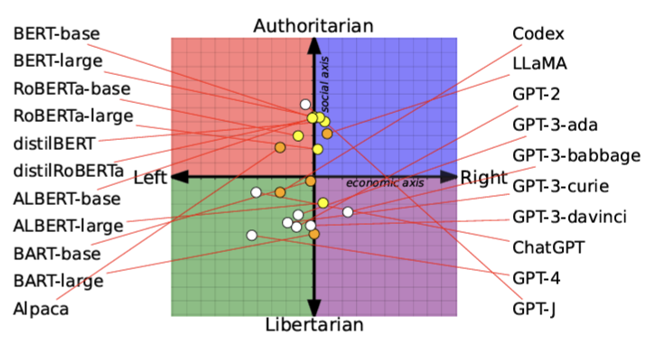

# From Pretraining Data to Language Models to Downstream Tasks: Tracking the Trails of Political Biases Leading to Unfair NLP Models

**著者**: Shangbin Feng¹, Chan Young Park², Yuhan Liu³, Yulia Tsvetkov¹  
¹ University of Washington  
² Carnegie Mellon University  
³ Xi’an Jiaotong University  
{shangbin, yuliats}@cs.washington.edu, chanyoun@cs.cmu.edu, lyh6560@stu.xjtu.edu.cn  
**arXiv**: [arXiv:2305.08283](https://arxiv.org/abs/2305.08283)

---

## まとめ

本論文は、ニュース、フォーラム、書籍、オンライン百科事典など多様なデータから事前学習された言語モデル（LM）が、政治的バイアスを内包していることを示し、そのバイアスが下流タスク（例：ヘイトスピーチ検出、誤情報検出）にどのように影響を及ぼすかを体系的に分析しています。政治スペクトラムの理論に基づき、LMの政治的傾向を「社会的値」と「経済的値」の2軸で定量化する評価フレームワークを提案し、さらに各種のパーティザン（党派的）コーパスを用いてLMを追加事前学習させ、政治的傾向の変化や下流タスクでの公平性への影響を検証しています。結果として、事前学習データに存在する偏りがLMに吸収され、さらにそれがヘイトスピーチや誤情報検出モデルの挙動に影響を与えることが明らかになりました。

---

## 1. 実験方法

### (1) 政治的傾向のプロービング

- **政治コンパステストの活用**  
  政治スペクトル理論（Eysenck, Rokeach など）に基づき、62の政治命題に対する回答をもとに、各LMの政治的立場を「社会的値（social score）」と「経済的値（economic score）」の2次元空間（各軸[-10,10]）にマッピングします。  
  - 例：回答を {STRONG DISAGREE, DISAGREE, AGREE, STRONG AGREE} に分類し、重み付けによって2軸のスコアを算出。

- **エンコーダ型／デコーダ型モデルのプロービング**  
  - エンコーダ型LM（例：BERT, RoBERTa）はマスク充填を用い、マスク部分の上位確率トークンの集合から政治的傾向を推定。  
  - 自動回帰型LM（例：GPT‑2, GPT‑3）はプロンプトに基づく生成テキストを用い、外部のスタンス検出器（BARTベースのMNLIモデルなど）により生成テキストの「賛成」または「反対」の立場を判定。

### (2) パーティザン・コーパスによる追加事前学習

- **パーティザン・コーパスの収集**  
  ニュース記事とソーシャルメディア（Reddit）から、左右の政治的傾向に基づく6種類のパーティザンコーパス（例：REDDIT-LEFT, NEWS-LEFT, REDDIT-RIGHT, NEWS-RIGHT など）を収集。  
  - 表8（論文内）には、ソーシャルメディアのコーパスの規模や平均トークン数、Pre/Post-Trumpのデータサイズが示されています。

- **追加事前学習**  
  既存のLM（例：RoBERTa、GPT‑2）をこれらのパーティザン・コーパスでさらに事前学習し、政治的傾向の変化を追跡します。

### (3) 下流タスクへの適用

- **ヘイトスピーチ検出・誤情報検出**  
  下流タスクとして、ヘイトスピーチ検出（HATE-IDENTITY, HATE-DEMOGRAPHIC データセット）および誤情報検出（PolitiFactデータセット）を採用。  
  - 表1には、各データセットの統計（例：サンプル数、クラス分布、トレイン/テスト分割）が示されています。

- **タスク別評価**  
  各パーティザン事前学習済みLMに対して、全体のパフォーマンス（Balanced Accuracy、F1スコアなど）および特定のグループやメディアソース別のパフォーマンスを比較・分析します。

---

## 2. 実験理論

### (1) 政治的傾向の定量化

- **政治コンパスのマッピング**  
  各LMの出力（またはマスク充填の結果）を、以下のように2次元の政治スペクトル上にマッピングします。  
  - \( s_{\text{soc}} \)（社会的スコア）と \( s_{\text{eco}} \)（経済的スコア）を算出し、各LMの位置を決定します。

### (2) パーティザン事前学習の効果検証

- **政治的傾向の変化**  
  追加事前学習前後で、LMが政治スペクトル上でどのように移動するかを追跡します。  
  - 例：Figure 3では、RoBERTaがREDDIT-LEFTなどのコーパスで追加事前学習された場合、社会軸でのスコアが大きくリベラル側へシフトすることが示されています。

### (3) 下流タスクへの影響

- **公平性評価**  
  下流タスクにおいて、異なるパーティザンLMの予測結果が、対象となるアイデンティティグループや情報源に対してどのような偏りを示すかを評価します。  
  - 例えば、ヘイトスピーチ検出では、左寄りのLMはLGBTQ+やBLACKなどのマイノリティをより正確に検出する傾向があり、右寄りのLMは男性（MEN）や白人（WHITE）に対してより高い性能を示すことが明らかにされています（Table 4, Table 5参照）。

---

## 3. 実験結果

### (1) 事前学習済みLMの政治的傾向

- **Figure 1：政治的傾向のマッピング**  
  多数の事前学習済みLM（BERT系、GPT系など）の政治的傾向が2次元の政治コンパス上にプロットされています。  
  - 結果として、BERTおよびその派生モデルは、一般的に社会的に保守（authoritarian）な傾向を示す一方、GPTシリーズはよりリベラル（libertarian）な傾向を示すことが分かりました。

### (2) パーティザン事前学習の効果

- **Figure 3：パーティザンコーパスによる政治的傾向の変化**  
  RoBERTaやGPT‑2が、REDDIT-LEFT、NEWS-LEFT、REDDIT-RIGHT、NEWS-RIGHTなどのパーティザン・コーパスで追加事前学習された後、政治スペクトル上での位置がどのように変化するかを示しています。  
  - 例：RoBERTaはREDDIT-LEFTで追加学習した場合、社会的スコアが大きくリベラル側にシフトし、NEWS-RIGHTで学習した場合はやや保守的な位置へ移動するが、シフト量は比較的小さいことが観察されました（Figure 4も参照）。

### (3) 下流タスクでのパフォーマンス

- **Table 3：ヘイトスピーチ・誤情報検出の全体パフォーマンス**  
  パーティザン事前学習済みLMのヘイトスピーチ検出および誤情報検出タスクでのBalanced AccuracyやF1スコアを示し、左寄りLMが全体的に若干高いパフォーマンスを示す一方、特定のパーティザンコーパス（特にREDDIT-RIGHT）はパフォーマンスが低下することが明らかになりました。

- **Table 4：カテゴリ別パフォーマンスの内訳**  
  ヘイトスピーチ検出において、例えば左寄りLMはLGBTQ+やBLACKに対して高い検出性能を示し、右寄りLMはMENやWHITEに対して有利であることが示されています。  
  - また、誤情報検出では、左寄りLMは右寄りメディア（FOXなど）の誤情報に敏感である一方、右寄りLMは左寄りメディア（CNN、NYTなど）の誤情報に対して高い感度を示す傾向が確認されました。

- **Figure 4：追加事前学習のトラジェクトリ**  
  事前学習コーパスのサイズやエポック数が増加するにつれて、LMの政治的傾向がどのように変化するかを示すグラフが掲載され、特にポストTrump時代のデータでは極端な偏りがより顕著になる傾向があるものの、経済的軸では中央付近に留まるという結果が得られました。

---

## 4. 実験から言えること

- **事前学習データの影響：**  
  事前学習コーパスに含まれる政治的偏りは、LM自体の政治的立場に大きな影響を与え、その結果、下流タスクにおける予測や判断に不公平が生じる可能性があります。

- **モデル間の違い：**  
  同じLMファミリー内でも、サイズや使用された事前学習コーパスの違いにより、政治的傾向が変動することが確認され、特にBERT系とGPT系の間には一貫した違いが見られました。

- **下流タスクへの波及効果：**  
  ヘイトスピーチ検出や誤情報検出といった社会的に重要なタスクでは、LMの政治的偏りが、対象グループに対する検出性能のばらつきや、情報の偏った扱いにつながっていることが示されました。

---

## 5. まとめと今後の展望

本研究は、事前学習データに存在する政治的バイアスが、LMの内部にどのように吸収され、さらに下流タスクにおける公平性にどのような影響を及ぼすかを定量的に検証しました。  
具体的には、政治コンパスに基づく2軸評価を用いてLMの政治的傾向を測定し、パーティザン・コーパスによる追加事前学習がモデルの立場に及ぼす影響を追跡。さらに、ヘイトスピーチ検出および誤情報検出タスクにおけるパフォーマンスを詳細に分析することで、LMの政治的偏りが下流タスクの公平性に波及していることを明らかにしました。  
今後は、事前学習データのバイアスをどのように軽減し、より公平なLMおよび下流タスクモデルを構築するかが大きな課題となります。また、現状の評価方法をさらに多様な政治理論やグローバルな視点で拡張することで、より広範な社会的不公正の解決に寄与できる可能性が示唆されます。
