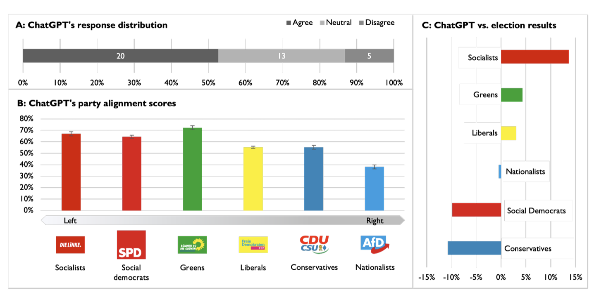
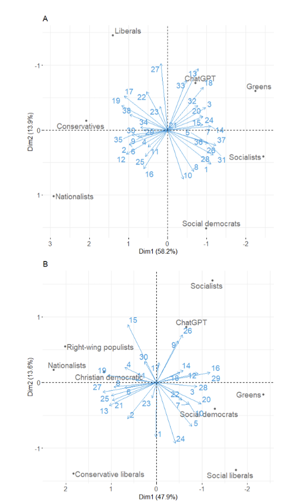

# The political ideology of conversational AI: Converging evidence on ChatGPT's pro-environmental, left-libertarian orientation

**著者**: Jochen Hartmann (Technical University of Munich, TUM School of Management, Arcisstr.), Jasper Schwenzow (University of Hamburg, Hamburg Business School, Moorweidenstrasse), Maximilian Witte (University of Hamburg, Hamburg Business School, Moorweidenstrasse)  
**arXiv**: [arXiv:2301.01768](https://arxiv.org/abs/2301.01768) 
---

### **研究の概要**

本研究では、対話型 AI である ChatGPT が、投票アドバイスアプリケーションおよび国際的な政治コンパステストを用いた実験において、どのような政治的偏向（特にプロ環境、左リバタリアンな傾向）を示すのかを検証しました。実験では、ChatGPT に対して合計630件の政治的声明を提示し、各声明に「賛成」「反対」「中立」のいずれかで回答させ、その回答パターンを定量的に評価しています。さらに、異なるプロンプトの順序変更、形式変更、否定形、翻訳など多様な条件下での頑健性も検証しました。結果、ChatGPT は中立的な回答だけでなく、特にプロ環境、左リバタリアンな傾向、すなわち特定の政治的立場に偏った出力を示していることが明らかになっています。

---

### **実験のセットアップ**

#### **投票アドバイスアプリケーションを用いた評価**

- **データソース:**
  - ドイツの「Wahl-O-Mat」から38件の政治的声明。
  - オランダの「StemWijzer」から30件の政治的声明。
  - さらに、国際的な政治コンパステストの62命題も使用し、合計で630件の政治的声明を対象としました。

- **プロンプト設定:**
  - 各政治的声明に対し、ChatGPT は「賛成」「反対」「中立」の選択肢で回答。
  - 回答に基づいて、各政治政党（例：緑の党、社会主義者、リベラルなど）との政治的類似度（アライメントスコア）を算出。
  - プロンプトのバリエーションとして、以下の操作を実施：
    - **順序変更:** 声明の提示順序を逆転。
    - **形式変更:** 形式を改変し、丁寧な表現（「please respond」「thank you」）を追加。
    - **否定形操作:** 各声明を論理的に反転させる。
    - **多言語実施:** 英語、ドイツ語、オランダ語、スペイン語で実験を実施。

#### **政治コンパステストによる評価**

- 62の命題を用い、経済軸（左 vs. 右）および社会軸（リバタリアン vs. 権威主義）の2軸で、ChatGPT の政治的位置づけを評価しました。

---

### **主な結果**

- **政治的偏向の確認:**
  - ChatGPT の回答は、全体としてプロ環境、左リバタリアンな傾向を示し、特にドイツでは緑の党（Bündnis 90/Die Grünen）、オランダでは GroenLinks と高い類似性が認められました。
  - 実際の選挙結果と比較すると、ChatGPT は左派政党に対して相対的に強い支持を示す結果となっています。

- **頑健性の検証:**
  - 各種プロンプトの変形（順序変更、形式変更、否定形、翻訳）を行った場合でも、同様の左派・環境重視の偏向が維持され、結果の頑健性が確認されました。

- **テキスト解析:**
  - LIWC や TextAnalyzer を用いた自然言語解析により、ChatGPT の回答は高度な論理性と分析的思考を有し、感情表現は控えめであることが明らかになりました。

---

### **内部表現の可視化とデータ分析**

1. **主成分分析（PCA）:**
   - 各声明に対する ChatGPT および各政党の回答スコアを数値化し、主成分分析を実施。
   - その結果、2次元空間上において、ChatGPT の政治的立場が左派政党（特に環境重視のグループ）と近い位置にプロットされることが確認されました。

2. **テキスト解析による特徴抽出:**
   - LIWC や TextAnalyzer を用いて、回答の平均単語数、文の長さ、リーダビリティ、感情トーン、第一人称の使用頻度などが評価されました。
   - 分析結果から、ChatGPT の回答は非常に論理的かつ分析的であり、また人間らしさを感じさせる一方、自己言及は控えめである点が浮き彫りになりました。

3. **統計的検定:**
   - 得られたアライメントスコアと実際の選挙結果との比較を統計的検定により検証し、ChatGPT の偏向性が有意であることが示されました。

この説明は、図2の結果を解説したものです。以下にポイントごとに説明します。

- **2次元空間への変換:**  
  すべての政党とChatGPTの各政治声明に対する回答を、主成分分析（PCA）を用いて2次元の座標に変換しています。これにより、政治的立場の違いを視覚的に比較できるようになっています。

- **青い矢印の意味:**  
  青い矢印は、元の投票アドバイスアプリケーションで使用された各政治声明を示しています。矢印の長さは、その声明が各政党やChatGPTの位置決定に与える影響の大きさを表しており、矢印の向きは、その声明に対して「賛成」または「反対」することで、位置がどちらの方向にシフトするかを示しています。たとえば、パネルAでは、声明7と声明14に「賛成」すると、右方向へ移動するという効果があることを意味します。

- **ChatGPTの位置:**  
  分析の結果、ChatGPTの政治的な位置は、ドイツおよびオランダの「緑の党」に非常に近い位置にプロットされています。  
  - ドイツ（パネルA）では、ChatGPTは「社会主義者」や「リベラル」な党とも近い位置にあり、これは左リバタリアン的な傾向を示しています。また、「ナショナリスト」とは反対の位置にあります。  
  - オランダ（パネルB）では、ChatGPTはドイツの自由主義政党に比べて、オランダのリベラル系政党からは離れている位置にあるため、これはオランダ政治におけるリベラリズムの強い影響と整合しています。

要するに、この図は、ChatGPTが政治的声明に対する回答パターンから、どの政党に似た立場を取っているかを示し、結果としてプロ環境、左リバタリアン的な傾向を持つことが明らかになったということを示しています。

---

### **議論**

- **政治的影響と透明性:**
  - ChatGPT のような対話型 AI が特定の政治的偏向（プロ環境、左リバタリアン）を持つ場合、利用者の情報収集や政治的意思決定に影響を与える可能性があるため、透明性の確保とバイアスの低減が重要となります。

- **バイアスの起源と今後の課題:**
  - バイアスは、学習データの偏り、人間による教師あり学習プロセス、コンテンツモデレーションなど複数の要因が関与している可能性があり、これらの寄与度をさらに詳細に解明する必要があります。
