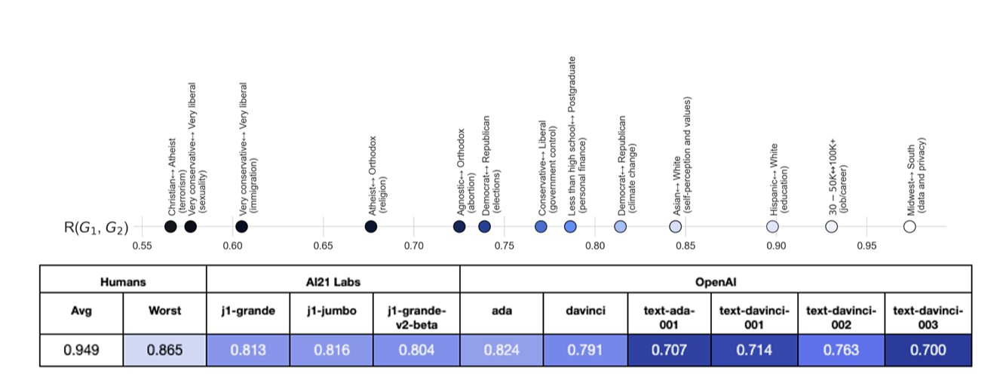
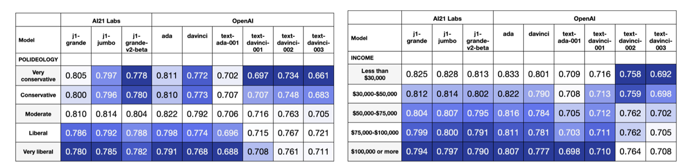
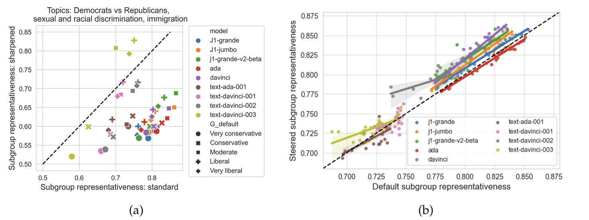
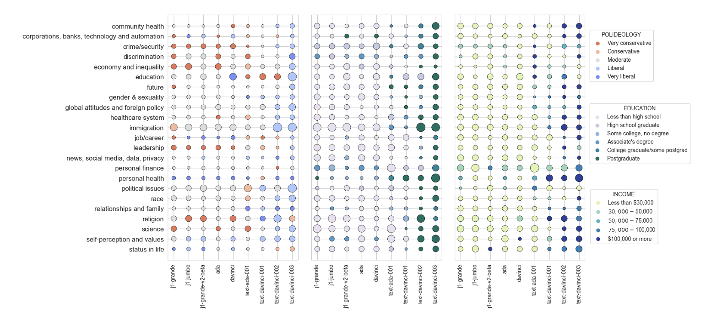

# Whose Opinions Do Language Models Reflect?

**著者**: Shibani Santurkar (Stanford University), Esin Durmus (Google Research), Faisal Ladhak (Google Research), Cinoo Lee (Stanford University), Percy Liang (Stanford University), Tatsunori Hashimoto (Stanford University)  
**arXiv**: [arXiv:2303.17548](https://arxiv.org/abs/2303.17548)

---

## まとめ

本研究は、Pew Research の公的意見調査データを用いて構築した OpinionQA データセットを使い、言語モデル（LM）が出力する意見分布が実際の人間（全体および60の人口統計グループ）の意見分布とどの程度一致しているかを定量的に評価するためのフレームワークを提案しています。  
主要な評価指標として、1-Wasserstein 距離に基づく意見整合性、全体代表性、特定グループとの代表性、ステアラビリティ（追加コンテキストによる調整効果）、およびトピック間の一貫性を導入。  
実験結果からは、LM は全体および特定のグループの多様な意見を十分に反映できておらず、特に RLHF（人間フィードバック）によるチューニング済みモデルは、モーダルな（単一の）意見に収束する傾向があること、さらにステアリングによる調整効果は限定的であり、トピックごとに大きく意見が変動するなど、一貫性に欠けることが示されました。  
これらの知見は、対話型AIの倫理的・社会的影響を考察する上で、LM の出力する意見のバイアスや多様性を改善するための新たなアプローチの必要性を示唆しています。

--- 

## 1. 実験方法

### (1) データセットと質問形式

- **データセット：OpinionQA**  
  - Pew Research の American Trends Panel（ATP）調査から抽出した全1,498問の多肢選択形式の質問を使用。
  - 各質問 \( q \) に対して、全回答者の意見分布 \( D_O(q) \) と、60の人口統計グループごとの意見分布 \( D_G(q) \) が得られる。
  - 表1では、各ATP調査の質問数、回答者数、サンプル質問がまとめられており、データの網羅性と信頼性を示しています。

### (2) モデルへのプロンプティング

- **標準QAプロンプト**  
  - 質問文のみをLMに提示し、各選択肢（例：「A: Strongly agree」～「D: Strongly disagree」）の次トークンの対数確率を取得して、LMの回答分布 \( D_m(q) \) を計算。

- **ステアリングプロンプト**  
  - 特定の人口統計グループ（例：「Democrat」など）の意見に合わせるため、追加コンテキスト（QA、BIO、PORTRAY形式）を付与し、同様に回答分布を取得。
  - 図（Figure 4b）では、ステアリング前後のグループ整合性の変化が示され、モデルがどの程度ターゲットグループに近づくかが評価されています。

### (3) 出力分布の算出

- 各質問 \( q \) に対し、LMは各選択肢の次トークン対数確率 \( \ell_p(o) \) を返すので、これを指数関数で変換し正規化して回答分布を得ます。

  \[
  D_m(q) = \frac{\left[ e^{\ell_p(A)},\, e^{\ell_p(B)},\, e^{\ell_p(C)},\, e^{\ell_p(D)} \right]}{\sum_{o \in \{A,B,C,D\}} e^{\ell_p(o)}}
  \]

- 拒否（Refusal）オプションは、順序性を持たないため別途評価されます。

---

## 2. 実験理論

### (1) 評価指標と定式化

#### ① 意見整合性

- 各質問 \( q \) において、LMの意見分布 \( D_m(q) \) と人間の意見分布 \( D(q) \) との間の1-Wasserstein距離 \( WD(D_m(q), D(q)) \) を計算し、質問集合 \( Q \) にわたる整合性を以下の式で定義します。

\[
A(D_1, D_2; Q) = \frac{1}{|Q|} \sum_{q \in Q} \left[ 1 - \frac{WD(D_1(q), D_2(q))}{N - 1} \right]
\]

ここで、\( N \) は拒否オプションを除いた選択肢数です。値は0（全く一致しない）から1（完全一致）まで取ります。

#### ② 代表性

- **全体代表性：**  
  LM のデフォルト意見分布 \( D_m \) と全体の人間意見分布 \( D_O \) との整合性は、

\[
R^O_m(Q) = A(D_m, D_O; Q)
\]

  図（Figure 2）では、各LMの \( R^O_m \) が示され、全体としての整合性が評価されています。

- **グループ代表性：**  
  特定の人口統計グループ \( G \) との整合性は、

\[
R^G_m(Q) = A(D_m, D_G; Q)
\]

  図（Figure 3）のヒートマップでは、各グループごとの整合性が視覚的に示され、特定グループとの代表性の低さが明らかになっています。

#### ③ ステアラビリティ

- 追加のコンテキスト \( c \) を用いた場合、グループ \( G \) 向けの回答分布を \( D_m(q; c) \) とし、最も高い整合性を示すコンテキストを採用します。

\[
S^G_m(Q) = \frac{1}{|Q|} \sum_{q \in Q} \max_{c \in \{\mathrm{QA},\, \mathrm{BIO},\, \mathrm{POR}\}} A(D_m(q; c), D_G(q))
\]

  図（Figure 4b）では、ステアリング前後の変化が示され、ステアリングの効果と限界が議論されています。

#### ④ 一貫性

- 複数トピック \( T \) において、まず全トピックで最も代表的なグループ \( G^*_m \) を決定します。

\[
G^*_m = \underset{G}{\operatorname{argmax}} \left( \frac{1}{T} \sum_{T'} R^G_m(Q_{T'}) \right)
\]

- その後、各トピック \( T \) での最も整合するグループが \( G^*_m \) と一致する割合を、一貫性 \( C_m \) として定義します。

\[
C_m = \frac{1}{T} \sum_{T} \mathbb{1}\!\left[ \underset{G}{\operatorname{argmax}}\, R^G_m(Q_T) = G^*_m \right]
\]

  図（Figure 5、Figure 6）では、LMのトピック間の一貫性の低さが示され、トピックによって異なるグループに整合していることが分かります。

---

## 3. 実験結果

### (1) 代表性

- **全体代表性（\( R^O_m \)）**  
  図（Figure 2）のグラフでは、各LMの全体代表性スコアが示され、特にRLHFによるチューニング済みモデルは全体の人間の意見分布から大きく逸脱していることが明らかになりました。  
  → これにより、モデルは人間の意見の多様性を十分に反映できていないことが示唆されます。

- **グループ代表性（\( R^G_m \)）**  
  図（Figure 3）のヒートマップにより、65歳以上、未亡人、宗教的出席頻度が高いグループなど、特定のグループとの整合性が低いことが示されています。  
  → 重要な人口統計グループの意見がLMに反映されにくいと結論付けられます。

### (2) ステアラビリティ

- 図（Figure 4b）では、追加コンテキストを付与することで、LMの意見分布がターゲットグループに近づく効果が確認されましたが、その改善は限定的です。  
  → ステアリングにより一定の調整は可能なものの、完全なグループ適合は難しいことが示されました。

### (3) 一貫性

- 図（Figure 5、Figure 6）の散布図から、トピックごとにLMが最も整合するグループが大きく異なることが明らかとなりました。  
  → LMは全体として一貫した意見を示しておらず、トピックによって極端に異なるグループの意見に寄っていることが分かります。

---

## 4. 実験から言えること

- **LMの意見分布の偏り:**  
  LMは全体および特定グループの多様な意見を十分に反映できておらず、RLHFによるチューニング済みモデルはモーダルな意見（例：リベラルな意見）に収束する傾向がある。

- **グループ間の不均一性:**  
  65歳以上や未亡人など、特定のグループとの代表性が低く、これらのグループの意見がLMに正確に反映されていない。

- **ステアリングの限界:**  
  コンテキストを付与することで調整効果は見られるが、全体の多様性を捉えるには至らず、特定のグループのモーダルな意見に偏りがち。

- **トピックごとの一貫性の低さ:**  
  LMはトピックによってどのグループの意見に寄るかが変動しており、全体としての一貫性は低い。

---

## 5. まとめ

本研究は、公開意見調査データを活用したOpinionQAデータセットを用いて、言語モデルが出力する意見が実際の人間の意見分布（全体および各人口統計グループ）とどの程度一致しているかを定量的に評価する新たなフレームワークを提案しました。  
具体的には、1-Wasserstein距離に基づく意見整合性指標を用いて、全体代表性、グループ代表性、ステアラビリティ、一貫性を厳密に定式化・評価しました。  
実験結果からは、LMは全体の意見や特定のグループの多様な意見を十分に反映できず、特にRLHFによるチューニング済みモデルは、単一のモーダルな意見に収束する傾向があること、またステアリングによる改善効果にも限界があることが明らかになりました。  
これらの知見は、LMをより多様な人間の意見に近づけるための新たなアプローチの必要性と、対話型AIシステムの倫理的・社会的影響についての議論に寄与するものです。
