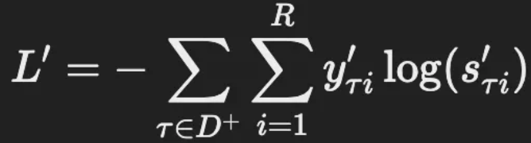

# arXiv.org KG-BERT: BERT for Knowledge Graph Completion

**概要**

この論文では、BERTを用いて知識グラフ（KG）の完成を行う新しい手法「KG-BERT」が提案されています。知識グラフは多くの人工知能タスクで重要ですが、しばしば不完全です。KG-BERTは、BERTの事前学習済み言語モデルを活用し、KG内の三重項（エンティティ、関係、エンティティ）をテキスト列として扱い、その三重項のスコアリングを行うことでKGの完成を目指します。これにより、三重項分類、リンク予測、関係予測などでの性能が向上します。

**理論と数式**

1. **三重項の形式**
    
    各エンティティと関係をテキストとして入力し、三重項 \((h, r, t)\) を一つの入力シーケンスとしてBERTに与えます。
    
2. **スコアリング関数**
    
    三重項のスコアリング関数は以下のように定義されます：
    ここで、$C$は[CLS]トークンに対応する最終的な隠れベクトルであり、$W$は分類層の重み行列です。
    
    

3. **損失関数**
    
    クロスエントロピー損失を用いて、正例の三重項セット $D^+$ と負例の三重項セット $D^-$ に対して次のように計算されます：
    
    ここで、$y_{\tau}$は三重項のラベルで、$s_{\tau}$は三重項が正または負である確率です。
    
    
4. **関係予測の損失関数**
    
    関係予測では、与えられた2つのエンティティ \(h\) と \(t\) に対して、関係 \(r\) のスコアが以下で計算されます：
    

    